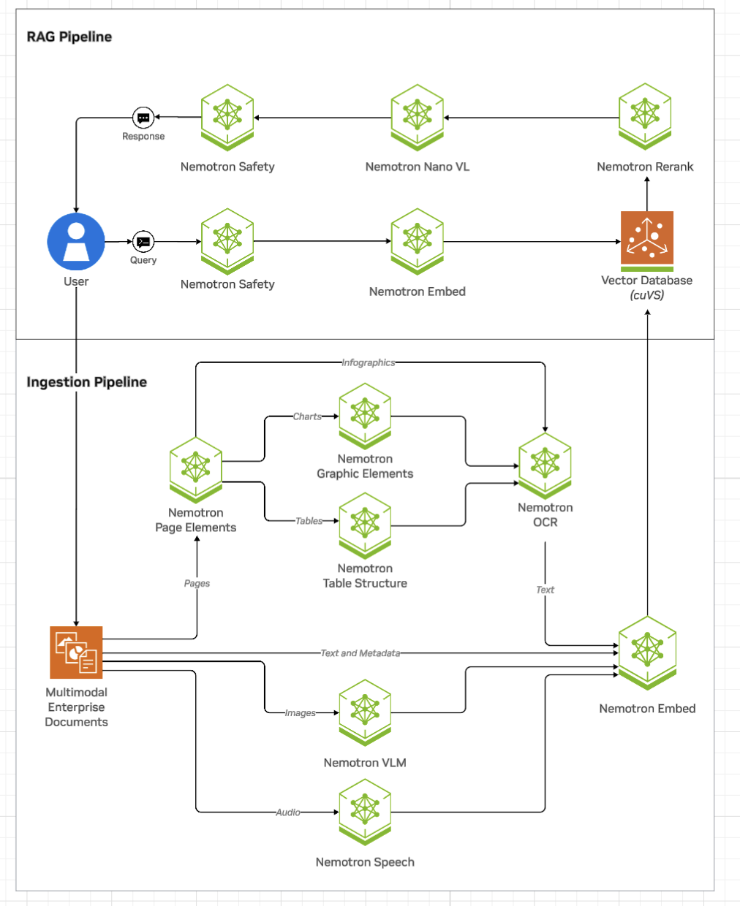

# Extract Speech with NeMo Retriever Library

This documentation describes two methods to run [NeMo Retriever Library](overview.md) 
with the [parakeet-1-1b-ctc-en-us ASR NIM microservice](https://docs.nvidia.com/nim/speech/latest/asr/deploy-asr-models/parakeet-ctc-en-us.html) 
(`nvcr.io/nim/nvidia/parakeet-1-1b-ctc-en-us`) to extract speech from audio files.

- Run the NIM locally on your cluster with the [NeMo Retriever Helm chart](https://github.com/NVIDIA/NeMo-Retriever/blob/main/helm/README.md)
- Use NVIDIA Cloud Functions (NVCF) endpoints for cloud-based inference

Currently, you can extract speech from the following file types:

- `mp3`
- `wav`


## Overview

[NeMo Retriever Library](overview.md) supports extracting speech from audio files for Retrieval Augmented Generation (RAG) applications. 
Similar to how the multimodal document extraction pipeline leverages object detection and image OCR microservices, 
NeMo Retriever Library uses the [parakeet-1-1b-ctc-en-us ASR NIM microservice](https://docs.nvidia.com/nim/speech/latest/asr/deploy-asr-models/parakeet-ctc-en-us.html) 
to transcribe speech to text, which is then embedded by using the NeMo Retriever embedding NIM. 

!!! important

    Due to limitations in available VRAM controls in the current release, the parakeet-1-1b-ctc-en-us ASR NIM microservice must run on a [dedicated additional GPU](support-matrix.md). For the full list of requirements, refer to [Support Matrix](support-matrix.md).

This pipeline enables users to retrieve speech files at the segment level.





## Run the NIM locally (Helm)

Use the following procedure to run the NIM on your own infrastructure.

!!! important

    The parakeet-1-1b-ctc-en-us ASR NIM microservice must run on a [dedicated additional GPU](support-matrix.md). Pin the workload to that GPU with your Helm values or the [NIM Operator](https://docs.nvidia.com/nim-operator/latest/index.html) (for example, node selectors, resource limits, or device requests appropriate to your cluster).

1. To access the required container images, log in to the NVIDIA Container Registry (nvcr.io). Use [your NGC key](api-keys.md) as the password. Run the following command in your terminal.

    - Replace `<your-ngc-key>` with your actual NGC API key.
    - The username is always `$oauthtoken`.

    ```shell
    $ docker login nvcr.io
    Username: $oauthtoken
    Password: <your-ngc-key>
    ```

2. For convenience and security, store [your NGC key](api-keys.md) in an environment variable file (`.env`). This enables services to access it without needing to enter the key manually each time. Create a .env file in your working directory and add the following line. Replace `<your-ngc-key>` with your actual NGC key.

    ```ini
    NGC_API_KEY=<your-ngc-key>
    ```

3. Deploy or upgrade NeMo Retriever extraction with the Helm chart and enable the ASR / audio components your release requires (Parakeet and related services). Follow [Deploy (Helm chart)](https://github.com/NVIDIA/NeMo-Retriever/blob/main/helm/README.md) and [Deployment options](deployment-options.md). Ensure the chart values for your cluster request the ASR NIM and any dependencies (for example, retrieval or Milvus) that match how you call the library.

4. After the services are running, you can interact with the pipeline by using Python.

    - The `Ingestor` object initializes the ingestion process.
    - The `files` method specifies the input files to process.
    - The `extract` method tells the pipeline to extract information from WAV audio files.
    - The `document_type` parameter is optional, because `Ingestor` should detect the file type automatically.

    ```python
    ingestor = (
        Ingestor()
        .files("./data/*.wav")
        .extract(
            document_type="wav",  # Ingestor should detect type automatically in most cases
            extract_method="audio",
            extract_audio_params={
                "segment_audio": True,
            },
        )
    )
    ```
To generate one extracted element for each sentence-like ASR segment, include `extract_audio_params={"segment_audio": True}` when calling `.extract(...)`. This option applies when audio extraction runs with a Parakeet NIM (either self-hosted on your cluster or remotely via NVCF) but has no effect when using the local Hugging Face Parakeet model.

    !!! tip

        For more Python examples, refer to [Python Quick Start Guide](https://github.com/NVIDIA/NeMo-Retriever/blob/main/client/client_examples/examples/python_client_usage.ipynb).


## Use NVCF Endpoints for Cloud-Based Inference

Instead of running the pipeline locally, you can use NVCF to perform inference by using remote endpoints.

1. NVCF requires an authentication token and a function ID for access. Ensure you have these credentials ready before making API calls.

2. Run inference by using Python. Provide an NVCF endpoint along with authentication details.

    - The `Ingestor` object initializes the ingestion process.
    - The `files` method specifies the input files to process.
    - The `extract` method tells the pipeline to extract information from WAV audio files.
    - The `document_type` parameter is optional, because `Ingestor` should detect the file type automatically.

    ```python
    ingestor = (
        Ingestor()
        .files("./data/*.mp3")
        .extract(
            document_type="mp3",
            extract_method="audio",
            extract_audio_params={
                "grpc_endpoint": "grpc.nvcf.nvidia.com:443",
                "auth_token": "<API key>",
                "function_id": "<function ID>",
                "use_ssl": True,
                "segment_audio": True,
            },
        )
    )
    ```

    !!! tip

        For more Python examples, refer to [Python Quick Start Guide](https://github.com/NVIDIA/NeMo-Retriever/blob/main/client/client_examples/examples/python_client_usage.ipynb).


## Related Topics

- [Support Matrix](support-matrix.md)
- [Troubleshoot Nemo Retriever Extraction](troubleshoot.md)
- [Use the Python API](nemo-retriever-api-reference.md)
