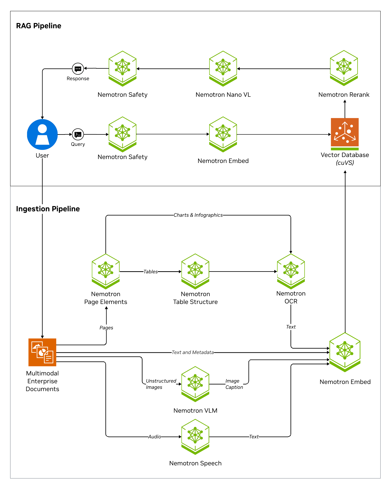

# What is NeMo Retriever Library?

NVIDIA NeMo Retriever Library (NRL) is a high retrieval accuracy, performant, and scalable framework for content and metadata extraction from various media types (PDFs, HTML, Word docs, Powerpoint, audio, video, and image files). It supports both NVIDIA NIM microservices and a range of models to find, contextualize, and extract text, tables, charts, infographics, and transcripts for use in downstream generative and retrieval-augmented applications.

NeMo Retriever Library enables parallelization of splitting documents into pages where sub-page content is classified (such as text paragraphs, tables, charts, and infographics), extracted, and further contextualized through optical character recognition (OCR) into a standard schema. From there, NeMo Retriever Library manages computation of embeddings for the extracted content,
and can store vectors in [LanceDB](https://lancedb.com/) for the recommended embedded path when you pass `vdb_op="lancedb"` to upload (refer to [Vector databases](vdbs.md)).

## NVIDIA AI Enterprise (NVAIE) support { #nvidia-ai-enterprise-nvaie-support }

!!! warning "The NeMo Retriever Library is not supported under NVIDIA AI Enterprise (NVAIE)"

    NVIDIA AI Enterprise (NVAIE) support does **not** cover the NeMo Retriever Library. This applies to the NeMo Retriever Library Python package, its container image, and its Helm chart artifacts.

    Some individual NIM microservices and models that the library calls—for example, the default NIMs in the [Pre-Requisites & Support Matrix](prerequisites-support-matrix.md#default-helm-nims)—may be covered by NVAIE on their own. That coverage applies only to those individual NIMs and models. It does **not** extend to the NeMo Retriever Library or its end-to-end extraction workflow. Using NVAIE-supported NIMs or models through the NeMo Retriever Library does not make the library, its container, or its chart NVAIE-supported.

## What NeMo Retriever Library Is ✔️

The following diagram shows the retriever pipeline.

NeMo Retriever Library does the following:

- Accept directories of input files and a series of configurable ingestion tasks to perform on that input
- Allow the extracted content be retrieved from a VDB containing discrete metadata element
- Support multiple extraction methods per document type—for example, PDFs can use **pdfium** or [Nemotron Parse](https://build.nvidia.com/nvidia/nemotron-parse) as an alternate method (`method="nemotron_parse"`)
- Support various types of pre- and post- processing operations, including text splitting and chunking, transform and filtering, embedding generation, and image offloading to storage.

!!! note
    To use `method="nemotron_parse"` with PDFs, install the Nemotron Parse client dependencies with the `nemotron-parse` extra, for example `pip install "nemo-retriever[nemotron-parse]"`.

NeMo Retriever Library supports the following file types:

- `avi`
- `bmp`
- `docx`
- `html` (converted to markdown format)
- `jpeg`
- `json` (treated as text)
- `md` (treated as text)
- `mkv` 
- `mov` 
- `mp3`
- `mp4` 
- `pdf`
- `png`
- `pptx`
- `sh` (treated as text)
- `svg` (NeMo Retriever Library only, requires `cairosvg`)
- `tiff`
- `txt`
- `wav`

## Related Topics

- [Pre-Requisites & Support Matrix](prerequisites-support-matrix.md)
- [Deployment options](deployment-options.md) — library, Helm, hosted vs self-hosted NIMs in one place
- [Deploy on Kubernetes with Helm](https://github.com/NVIDIA/NeMo-Retriever/blob/main/nemo_retriever/helm/README.md)
- [Notebooks](https://github.com/NVIDIA/NeMo-Retriever/blob/main/examples/README.md)
- [NVIDIA AI Blueprints catalog](https://build.nvidia.com/explore/discover) — solution cards, enterprise RAG blueprints, and end-to-end patterns (including [Enterprise RAG — multimodal PDF data extraction](https://build.nvidia.com/nvidia/multimodal-pdf-data-extraction-for-enterprise-rag))
- For integration pathways, refer to [Starter kits](https://github.com/NVIDIA/NeMo-Retriever/blob/main/examples/README.md).
