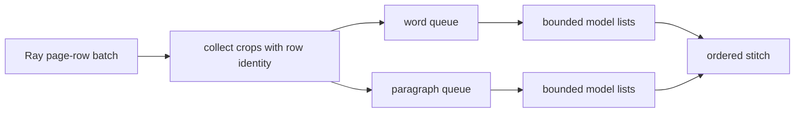
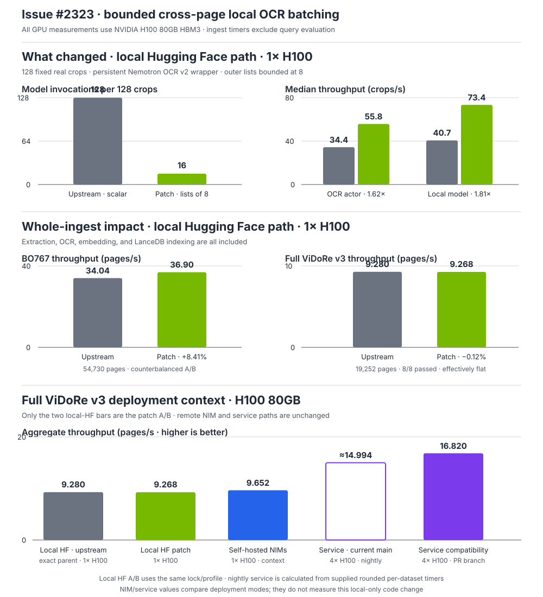

# Local Nemotron OCR v2 cross-page batching

Issue: [#2323](https://github.com/NVIDIA/NeMo-Retriever/issues/2323)

## Decision

Batch compatible local OCR crops across every page row delivered to one
`OCRActor`. Split table (`word`) and paragraph jobs, bound each model list by
`inference_batch_size`, and stitch ordered results back to their source row and
detection.

The old local path created and invoked jobs inside the page-row loop, so sparse
pages reached the persistent model as singleton calls. Collection now spans the
Ray batch while retaining row identity.



Three differently scoped controls remain independent:

| Control | Unit | Owner | Controlled actor A/B |
|---|---|---|---:|
| Ray supply batch | page rows per actor call | Ray graph | 32 |
| Outer OCR list | crops per model call | `OCRActor` | 8 |
| Internal detector batch | images per detector forward | `nemotron-ocr` | 8 |

The patch changes only the middle layer. It does not change defaults or wire
the actor setting into Nemotron's internal detector policy.

## Evidence

### Correctness

The red/green regression uses one pandas batch with two page rows, one chart per
row, `inference_batch_size=2`, and a recording list-input model.

| Behavior | Upstream | Patch |
|---|---|---|
| Paragraph calls | `[page A]`, `[page B]` | `[page A, page B]` |
| Invocation count | 2 | 1 |
| Crops per invocation | `[1, 1]` | `[2]` |
| Row, bbox, and fake output identity | preserved | preserved |

The four focused tests also cover merge-level separation, bounded chunking,
empty and malformed pages, native-text preservation, batch exceptions,
wrong-result-count fallback, and per-crop failure isolation. Fallback occurs
only on an exception or wrong result count.

### Result summary



The actor/model and one-GPU BO767 comparisons are attributable A/B evidence for
this patch. The default multi-GPU local comparison is a scale/correctness check
with an exact eight-GPU upstream control. The NIM and service panels are
compatibility context only: their backend paths and GPU counts differ.

The controlled GPU A/B traversed Ray Data, the real `OCRActor`, one persistent
local wrapper, and the locked Nemotron OCR v2 model. It used 128 fixed real
crops (64 tables and 64 charts), one warmup, and five measured trials on one
H100 80GB.

| Measurement | Upstream | Patch | Effect |
|---|---:|---:|---:|
| Model invocations per 128 crops | 128 x scalar | 16 x list-of-8 | 87.5% fewer |
| Median actor throughput | 34.418 crops/s | 55.787 crops/s | 1.621x |
| Median model throughput | 40.654 crops/s | 73.389 crops/s | 1.805x |

### Whole-ingest speedup

**On BO767, the patch reduced mean whole-ingest runtime by 7.75% and increased
throughput by 8.41%.** The harness timer starts immediately before
`run_ingest_workflow(...)` and stops after it returns. It therefore includes the
complete batch ingest through extraction, OCR, embedding, and LanceDB indexing;
query evaluation is outside this timer.

BO767 supplied a sustained OCR-heavy test: 767 PDFs, 54,730 pages, 79,233-79,234
extracted rows, and 991 scored queries. It used Ray page-row batches of 24,
OCR crop lists capped at 8, one H100, and counterbalanced order (`upstream,
patch, patch, upstream`).

| Run | Ingest runtime | Throughput | Rows |
|---|---:|---:|---:|
| Upstream 1 | 1,612.811 s | 33.935 pages/s | 79,234 |
| Patch 1 | 1,476.246 s | 37.074 pages/s | 79,233 |
| Patch 2 | 1,490.440 s | 36.721 pages/s | 79,234 |
| Upstream 2 | 1,603.227 s | 34.137 pages/s | 79,234 |

The configuration means were 1,608.019 seconds upstream and 1,483.343 seconds
patched: **124.676 seconds (7.75%) less ingest time** and **8.41% higher
throughput**. Both matched pairs were faster (`-8.47%` and `-7.03%`). This is
the whole-ingest speedup result for the corrected batching behavior.

The shorter `vidore_v3_computer_science_beir` run is retained as a useful
limit: it ran the same complete ingest boundary over 1,360 pages, but was too
short to separate the patch from warm-run variation.

| Run | Ingest runtime | Throughput |
|---|---:|---:|
| Upstream 1 (coldest) | 181.616 s | 7.488 pages/s |
| Patch 1 | 168.388 s | 8.077 pages/s |
| Patch 2 | 169.506 s | 8.023 pages/s |
| Upstream 2 | 168.330 s | 8.079 pages/s |

Its first pair favored the patch by 7.3%, while the counterbalanced warm pair
was effectively tied. That does not contradict the BO767 result; it shows that
a two-document run is underpowered for a whole-ingest performance claim.

### Default multi-GPU batch scaling

A separate current-commit run exposed two, four, or eight H100s to batch mode
and left every worker count on `auto`. The same eight ViDoRe runfiles, dataset
order, cache, lock, package versions, and OCR crop-list cap of 8 were used at
each point. The eight-GPU comparison was counterbalanced as patch, exact
`upstream/main`, patch.

| Source | Visible GPUs | Ingest runtime | Throughput | Recall@5 | nDCG@10 | Peak memory on one GPU |
|---|---:|---:|---:|---:|---:|---:|
| Patch | 2 | 1,142.447 s | 16.852 pages/s | 0.4615 | 0.5174 | 34,938 MiB |
| Patch | 4 | 951.175 s | **20.240 pages/s** | 0.4650 | 0.5205 | 36,544 MiB |
| Patch A | 8 | 989.582 s | 19.455 pages/s | 0.4633 | 0.5188 | 43,034 MiB |
| Exact upstream | 8 | 965.978 s | 19.930 pages/s | 0.4635 | 0.5189 | 39,532 MiB |
| Patch B | 8 | 991.837 s | 19.410 pages/s | 0.4620 | 0.5170 | 43,208 MiB |

All five runs passed all eight datasets without an OCR error or OOM. The two
patch eight-GPU runs differed by only 0.23% in ingest time. Their mean was
990.710 seconds (19.433 pages/s), so the exact upstream control was 2.50%
faster and the four-GPU patch run was 4.16% faster than the patch eight-GPU
mean. The supplied nightly reference, 959.58 seconds and 20.06 pages/s, was
close to the exact upstream control (-0.65% throughput).

This proves the corrected path executes successfully when eight GPUs are
exposed, but it does **not** demonstrate positive eight-GPU scaling for this
suite. Six datasets were fastest on four GPUs, `industrial` was fastest on
eight, and `physics` was fastest on two:

| Dataset | 2 GPU | 4 GPU | 8 GPU patch mean | Fastest |
|---|---:|---:|---:|---:|
| `computer_science` | 102.007 s | **91.290 s** | 104.433 s | 4 GPU |
| `energy` | 138.966 s | **115.108 s** | 122.040 s | 4 GPU |
| `finance_en` | 199.473 s | **160.173 s** | 163.430 s | 4 GPU |
| `finance_fr` | 150.908 s | **118.884 s** | 127.161 s | 4 GPU |
| `hr` | 95.646 s | **92.709 s** | 103.058 s | 4 GPU |
| `industrial` | 241.673 s | 175.424 s | **152.791 s** | 8 GPU |
| `pharmaceuticals` | 123.499 s | **103.250 s** | 110.217 s | 4 GPU |
| `physics` | **90.275 s** | 94.337 s | 107.579 s | 2 GPU |

The default resource policy creates three initial OCR actors per visible GPU
and reserves 0.1 GPU per actor. NVML process sampling observed 6, 12, and 24
OCR actors per dataset at the two-, four-, and eight-GPU points, but those OCR
processes occupied only 2, 2, and 3 physical GPUs respectively. All eight GPUs
did receive work across the complete eight-GPU pipeline; OCR placement itself
was not even. Together with the dataset crossover, this makes actor
startup/placement and crop-list occupancy the leading scale explanation, not
GPU capacity. A falsifiable next investigation is to record outer list-size
histograms and actor startup time at 2/4/8 GPUs before changing Ray defaults.
Worker policy is deliberately outside this correctness patch.

### Retrieval non-regression

The same ViDoRe run evaluated 1,290 queries and 6,294 qrels. Because repeated
full runs changed page text and rankings even within one configuration, every
query was embedded once and those same vectors were applied to all four stored
corpora using deterministic exact top-10 search.

| Metric | Upstream mean | Patch mean | Delta |
|---|---:|---:|---:|
| nDCG@10 | 0.7093766 | 0.7093501 | -0.0000265 |
| Recall@5 | 0.6000979 | 0.6000979 | 0.0000000 |
| Recall@10 | 0.7306446 | 0.7307415 | +0.0000969 |

Both matched pairs had identical Recall@5; the warm pair also had identical
Recall@10. Mean top-10 overlap was 99.91%. No retrieval regression was observed
after controlling query and index execution randomness.

BO767's configuration means were likewise neutral within run variance:

| Metric | Upstream mean | Patch mean | Delta |
|---|---:|---:|---:|
| nDCG@10 | 0.752780 | 0.753359 | +0.000579 |
| Recall@5 | 0.850151 | 0.849647 | -0.000505 |
| Recall@10 | 0.899092 | 0.900101 | +0.001009 |

Cross-configuration mean top-10 overlap was 98.58%; upstream-versus-upstream
overlap was lower at 98.22%. Exact stored text also varied substantially across
identical upstream runs, while structural row overlap remained above 99.4%.
The one-row variation appeared in one patch replicate only, so it was not a
stable patch effect. Every run had the same two non-fatal overlength embedding
failures, zero OCR warnings, and zero OOMs.

### Full ViDoRe v3 confirmation

The patched local path also completed all eight ViDoRe v3 runfiles: 189 PDFs,
19,252 pages, 19,252 output rows, and 14,514 scored queries. Total ingest time
was 2,077.167 seconds (9.268 pages/s) on one H100, with Ray page-row batches of
24 and OCR crop lists capped at 8. All eight runs passed with zero OCR errors or
OOMs. The complete harness command, including query evaluation, took 3,134
seconds wall time.

The nightly values below are the rounded reference supplied for the same
datasets; upstream was intentionally not rerun. These deltas are therefore a
quality confirmation, not a causal A/B result. Speedup attribution comes from
the controlled actor and BO767 comparisons above.

| Dataset | Pages | Ingest | Pages/s | Recall@5 | Delta vs nightly | nDCG@10 | Delta vs nightly |
|---|---:|---:|---:|---:|---:|---:|---:|
| `computer_science` | 1,360 | 171.200 s | 7.944 | 0.5995 | -0.0015 | 0.7091 | -0.0009 |
| `energy` | 2,225 | 257.985 s | 8.625 | 0.5785 | +0.0005 | 0.5839 | -0.0001 |
| `finance_en` | 2,942 | 343.808 s | 8.557 | 0.4957 | -0.0023 | 0.5475 | -0.0005 |
| `finance_fr` | 2,384 | 279.635 s | 8.525 | 0.3263 | -0.0007 | 0.3518 | +0.0008 |
| `hr` | 1,110 | 151.708 s | 7.317 | 0.4529 | -0.0001 | 0.5312 | +0.0002 |
| `industrial` | 5,244 | 536.309 s | 9.778 | 0.3482 | +0.0002 | 0.3816 | -0.0004 |
| `pharmaceuticals` | 2,313 | 212.344 s | 10.893 | 0.5447 | -0.0043 | 0.6043 | -0.0027 |
| `physics` | 1,674 | 124.178 s | 13.481 | 0.3703 | +0.0003 | 0.4539 | +0.0019 |

| Macro average | Recall@5 | Delta vs nightly | nDCG@10 | Delta vs nightly |
|---|---:|---:|---:|---:|
| English | 0.4843 | -0.0007 | 0.5445 | -0.0005 |
| All datasets | 0.4645 | -0.0005 | 0.5204 | -0.0006 |

The largest individual shift was `pharmaceuticals` (-0.0043 Recall@5 and
-0.0027 nDCG@10). The reference is rounded to three decimals and is a separate
nightly run, so no tighter equivalence claim is made.

### Self-hosted NIM and service compatibility

The current `service-mode.compose.yaml` pins the relevant core services to:

| Service | Image | Local digest |
|---|---|---|
| Page elements and table structure | `nemotron-object-detection:2.0.0` | `sha256:de21875223e4cc26b79e44a4f30ff06dcc8fe97c731c6b9f500a48eb54fa99bf` |
| OCR | `nemotron-ocr-v2:2.0.0` | `sha256:3ac2ea60a83d7aab6275e08ea27a959de46fdab0689594f54f8374f590f416b8` |
| Embedding | `llama-nemotron-embed-vl-1b-v2:1.12.0` | `sha256:58c40b920840be6e2f4ad5d77c32c65d61e048070fe45d51fb4bdb6f84a71e21` |

The first compatibility smoke placed the four containers on separate H100s.
A subsequent full-suite comparison placed page detection, table structure,
OCR, and embedding together on GPU 0. Docker device requests for every
container named only device `0`; sampled memory and utilization on GPUs 1-7
remained zero. GPU 0 peaked at 16,331 MiB and 100% utilization. The Compose
default `NIM_PIPELINE_MAX_BATCH_SIZE=1` was retained for page detection, table
structure, and OCR; this validation did not tune NIM internals or use an
unbounded request.

A direct OCR endpoint probe sent one ordered list containing two fixed
paragraph crops. It received two results in the same order and preserved both
crop anchors. This proves the deployed OCR NIM's bounded list-input contract;
it does not prove that the unchanged application remote path forms cross-page
lists.

#### Full one-GPU batch comparison

The one-GPU NIM deployment completed the same eight ViDoRe runfiles as the
one-GPU local-HF path: 19,252 pages and 14,514 queries, with no failed run,
container restart, OCR error, or OOM. Both used the batch CLI and LanceDB. The
NIM harness ran with an empty `CUDA_VISIBLE_DEVICES`, ensuring that all model
work went through the four endpoints on GPU 0.

| Dataset | NIM ingest | NIM pages/s | Local-HF ingest | NIM time effect | Recall@5 delta vs local | nDCG@10 delta vs local |
|---|---:|---:|---:|---:|---:|---:|
| `computer_science` | 149.002 s | 9.127 | 171.200 s | -12.97% | -0.0095 | -0.0100 |
| `energy` | 237.900 s | 9.353 | 257.985 s | -7.79% | -0.0147 | -0.0169 |
| `finance_en` | 353.536 s | 8.322 | 343.808 s | +2.83% | -0.0163 | -0.0217 |
| `finance_fr` | 269.278 s | 8.853 | 279.635 s | -3.70% | -0.0185 | -0.0205 |
| `hr` | 145.796 s | 7.613 | 151.708 s | -3.90% | -0.0097 | -0.0124 |
| `industrial` | 510.831 s | 10.266 | 536.309 s | -4.75% | +0.0009 | +0.0016 |
| `pharmaceuticals` | 200.500 s | 11.536 | 212.344 s | -5.58% | +0.0018 | +0.0036 |
| `physics` | 127.785 s | 13.100 | 124.178 s | +2.90% | -0.0170 | -0.0111 |

The total NIM ingest was 1,994.628 seconds (9.652 pages/s), versus 2,077.167
seconds (9.268 pages/s) for local HF: **3.97% less ingest time and 4.14% higher
throughput**. Six datasets favored NIM and two favored local HF. This is a
single full-suite backend comparison, not a controlled attribution to the
local-only batching patch.

Relevance did not establish parity:

| Macro average | NIM Recall@5 | Local HF | Nightly | NIM nDCG@10 | Local HF | Nightly |
|---|---:|---:|---:|---:|---:|---:|
| English | 0.4751 | 0.4843 | 0.485 | 0.5350 | 0.5445 | 0.545 |
| All datasets | 0.4541 | 0.4645 | 0.465 | 0.5095 | 0.5204 | 0.521 |

The NIM gap versus local HF was -0.0092/-0.0095 on English Recall@5/nDCG@10
and -0.0104/-0.0109 across all datasets. A preceding NIM
`computer_science` pilot scored 0.5975/0.7070, while the suite repeat scored
0.5901/0.6990, so real run-to-run variation exists. The broadly lower suite
macro still requires backend isolation before treating the paths as equivalent.
NIM query p50 was 198.4-201.5 ms across datasets, versus 41.0-47.5 ms for
local HF; query time is outside ingest pages/s.

#### Full four-GPU service comparison

The standalone service completed the full eight-dataset suite with page
detection, table structure, OCR, and embedding assigned to GPUs 0-3. GPUs 4-7
remained unused. The model services stayed persistent across the suite; only
retriever and vector-store state was reset between datasets.

| Dataset | Service ingest | Pages/s | Query p50 | Recall@5 | Delta vs nightly | nDCG@10 | Delta vs nightly |
|---|---:|---:|---:|---:|---:|---:|---:|
| `computer_science` | 114.229 s | 11.906 | 58.719 ms | 0.6001 | -0.0009 | 0.7100 | +0.0000 |
| `energy` | 125.725 s | 17.697 | 65.943 ms | 0.5660 | -0.0120 | 0.5684 | -0.0156 |
| `finance_en` | 217.587 s | 13.521 | 61.112 ms | 0.4794 | -0.0186 | 0.5259 | -0.0221 |
| `finance_fr` | 185.335 s | 12.863 | 61.014 ms | 0.3082 | -0.0188 | 0.3313 | -0.0197 |
| `hr` | 68.946 s | 16.100 | 60.261 ms | 0.4480 | -0.0050 | 0.5234 | -0.0076 |
| `industrial` | 279.011 s | 18.795 | 65.456 ms | 0.3490 | +0.0010 | 0.3831 | +0.0011 |
| `pharmaceuticals` | 101.669 s | 22.750 | 69.020 ms | 0.5475 | -0.0015 | 0.6074 | +0.0004 |
| `physics` | 52.073 s | 32.147 | 65.281 ms | 0.3667 | -0.0033 | 0.4518 | -0.0002 |

Total service ingest was 1,144.575 seconds (16.820 pages/s): **44.90% less
ingest time and 81.48% higher throughput than one-GPU local HF**, and 42.62%
less time and 74.27% higher throughput than the one-GPU NIM deployment.
Service query p50 stayed between 58.7 and 69.0 ms, versus 41.0-47.5 ms for
local HF and 198.4-201.5 ms for direct one-GPU NIM batch mode.

| Macro average | Service Recall@5 | Local HF | NIM | Nightly | Service nDCG@10 | Local HF | NIM | Nightly |
|---|---:|---:|---:|---:|---:|---:|---:|---:|
| English | 0.4795 | 0.4843 | 0.4751 | 0.485 | 0.5386 | 0.5445 | 0.5350 | 0.545 |
| All datasets | 0.4581 | 0.4645 | 0.4541 | 0.465 | 0.5127 | 0.5204 | 0.5095 | 0.521 |

Service relevance was better than direct NIM batch by about 0.003-0.004 macro,
but remained 0.005-0.008 below local HF and nightly. Backend relevance parity
is therefore not established.

The first sequential service attempt exposed an important isolation problem:
`overwrite=true` did not clear the persistent service collection between
runfiles. By `pharmaceuticals`, query hits included 58 PDF sources outside its
52-PDF corpus, and p50 had risen from 59 to 95 ms. A deterministic artifact
check failed that run. The valid suite above recreated only retriever and
vector-store volumes between datasets, retained all four NIM processes, and
asserted zero foreign sources after every run. All eight checks passed. The
accumulating-run relevance and latency values are excluded.

The separately supplied latest `computer_science` service baseline was 10.11
pages/s. The isolated run measured 11.906 pages/s with the same 0.6001/0.7100
quality profile as the earlier service smoke. These deployment results validate
the current NIM/service stack; they do not attribute remote performance to this
local-only patch.

#### BO767 four-GPU service result

The same isolated service topology also completed BO767 with the four core
NIMs pinned one per GPU. Retriever and vector-store volumes were recreated
immediately before the run; all 767 files and 991 queries completed with zero
failed ingest jobs, container restarts, OCR errors, or OOMs.

| Measurement | Result | Supplied baseline | Effect |
|---|---:|---:|---:|
| Ingest runtime | 623.545 s | 646.621 s implied | 3.57% lower |
| Throughput | **87.772 pages/s** | 84.64 pages/s | **3.70% higher** |
| Recall@5 | 0.856710 | - | - |
| Recall@10 | 0.907164 | - | - |
| nDCG@10 | 0.761228 | - | - |

The client used an empty `CUDA_VISIBLE_DEVICES`, so all model inference went
through the NIM endpoints. Peak sampled memory on GPUs 0-3 was 1,929, 1,923,
3,865, and 9,698 MiB respectively; GPUs 4-7 remained unused. This is a service
deployment result and is not caused by the local-only batching change.

Three current Compose portability/configuration issues required `/tmp`-only
workarounds; none is changed by this PR and all are tracked in
[#2424](https://github.com/NVIDIA/NeMo-Retriever/issues/2424):

- this Docker daemon has no named `nvidia` runtime, so the override used
  `runtime: runc` while retaining Compose GPU device reservations;
- the non-root NIM containers could not write the root-owned named model-store
  volumes, so writable `/tmp` bind mounts were used;
- the generated service config includes `local_models.extract.use_graphic_elements`,
  which the current `ServiceConfig` rejects, so only that invalid key was
  removed from a temporary config before the service run.

## Scope and validation

This record supports the local Nemotron OCR v2 change only. The remote NIM and
service runs establish compatibility but do not change or attribute speedup to
the remote OCR path. JP20 was not run and byte-identical real OCR output is not
claimed. The multi-GPU local-HF, one-GPU NIM, and four-GPU service runs sampled
all eight devices continuously. The bounded local-HF batch of 8, four colocated
NIMs, and four-GPU service deployment were OOM-free on the tested H100s;
smaller GPU classes require separate sizing evidence.

The BO767 command was repeated against exported upstream and patch source
trees, changing only `PYTHONPATH` and the output/run identifiers:

```bash
CUDA_VISIBLE_DEVICES=0 HF_HUB_OFFLINE=1 HF_DATASETS_OFFLINE=1 \
VLLM_DEEP_GEMM_WARMUP=skip PYTHONPATH=<source>/nemo_retriever/src \
retriever harness run bo767_beir --mode batch --output-dir <run> \
  --run-id <id> \
  --set dataset.path=/localhome/local-jioffe/datasets/nv-ingest/bo767 \
  --set ingest.extract.extract_charts=true \
  --set ingest.extract.extract_tables=true \
  --set ingest.extract.batch.ocr_batch_size=8 --json
```

Validation on the rebased PR worktree:

- expected upstream red: 1 failed in 0.08s;
- focused patch suite: 4 passed in 0.60s;
- related actor, graph, OCR, table, and video tests: 327 passed, 7 skipped;
- all pre-commit hooks and required PR validation checks passed.

The expanded local ViDoRe run used:

```bash
CUDA_VISIBLE_DEVICES=0 HF_HUB_OFFLINE=1 HF_DATASETS_OFFLINE=1 \
VLLM_DEEP_GEMM_WARMUP=skip retriever harness run-files \
  nemo_retriever/harness/runfiles/vidore_v3_{computer_science,energy,finance_en,finance_fr,hr,industrial,pharmaceuticals,physics}_beir.json \
  --dataset-paths <dataset_paths.yaml> --mode batch \
  --output-dir <output> --session-name issue-2323-vidore-local-batch --json
```

The default multi-GPU runs changed only the visible-device set; no worker
count was supplied:

```bash
CUDA_VISIBLE_DEVICES=<0,1 | 0,1,2,3 | 0,1,2,3,4,5,6,7> \
HF_HUB_OFFLINE=1 HF_DATASETS_OFFLINE=1 VLLM_DEEP_GEMM_WARMUP=skip \
uv run --frozen --project nemo_retriever retriever harness run-files \
  nemo_retriever/harness/runfiles/vidore_v3_{computer_science,energy,finance_en,finance_fr,hr,industrial,pharmaceuticals,physics}_beir.json \
  --dataset-paths <dataset_paths.yaml> --mode batch \
  --output-dir <output> --session-name <unique-session> --json
```

For the NIM checks, the same `computer_science` runfile was invoked first with
`--mode batch` and the four `localhost:8001` through `:8004` endpoint
overrides, then with `--mode service --service-endpoint http://localhost:7670`.
The full service image was built from the rebased PR commit. The one-GPU full
suite used the same eight runfiles shown above and these endpoint overrides:

```bash
CUDA_VISIBLE_DEVICES= retriever harness run-files <eight-runfiles> \
  --dataset-paths <dataset_paths.yaml> --mode batch \
  --output-dir <output> --session-name issue-2323-one-gpu-nim-full-vidore \
  --set ingest.extract.page_elements_invoke_url=http://localhost:8001/v1/page-elements \
  --set ingest.extract.table_structure_invoke_url=http://localhost:8002/v1/table-structure \
  --set ingest.extract.ocr_invoke_url=http://localhost:8003/v1/ocr \
  --set ingest.embed.embed_invoke_url=http://localhost:8004/v1/embeddings \
  --set query.embed_invoke_url=http://localhost:8004/v1/embeddings --json
```

The valid service suite ran each runfile separately with the same four NIM
processes. Before each run, it recreated only the experiment's retriever and
vector-store volumes, waited for service health, and then invoked:

```bash
CUDA_VISIBLE_DEVICES= retriever harness run-files <one-runfile> \
  --dataset-paths <dataset_paths.yaml> --mode service \
  --service-endpoint http://localhost:7670 --output-dir <output> \
  --session-name <unique-session> --json
```

Each result was followed by an assertion that every returned `source` belonged
to the current runfile's PDF corpus.

BO767 service mode used the same healthy four-NIM stack and fresh service
storage:

```bash
CUDA_VISIBLE_DEVICES= retriever harness run-files \
  nemo_retriever/harness/runfiles/bo767_beir.json \
  --dataset-paths <dataset_paths.yaml> --mode service \
  --service-endpoint http://localhost:7670 --output-dir <output> \
  --session-name issue-2323-bo767-service-g4 --json
```

ViDoRe used source commit `611af594818342b655b5e9ae89c66aea2cbc3963`.
BO767 compared upstream `52886112cafab4c4bca1cda0d4f588785adfe4d3`
with patch `eaed9262780c45c1dce9e9a929357f2bcd886234`. Both used lock SHA-256
`d9651104d0a10277642fa7e4794976948177f24c273da203e6bb694107d20bf6`.
Installed versions were `nemotron-ocr==2.0.1.dev20260720042916`,
`ray==2.55.1`, and `torch==2.11.0+cu130`.

The expanded ViDoRe suite was measured at pre-rebase commit
`3c4ddef05ac8497855f346e68ef9c573e980fb0b`. Rebase added one upstream
service-only commit; the patched `shared.py` SHA-256 remained
`68cd70abbe1ef1beb1cac3fdd197053dfba946c63dd69f8c07623ff2b585ce72`.
The NIM and service checks used rebased commit
`5a8ebd9e5468be4a72ae9888a7d0cba173e44e96`. The full one-GPU NIM suite used
commit `451ba127ea6fba72720c7f66753e2b73273eff6f`, whose merge base was current
`upstream/main` at `3d9e26f1a2d2fd73af499bb7a9ef7fe855739841`; the harness command took
5,456.73 seconds wall time including serial query evaluation. The isolated
full-service suite used PR commit
`3363bf663bbca03fd8300c07d7271a8000533694`; its runtime source was unchanged
from service-image commit `5a8ebd9e5468be4a72ae9888a7d0cba173e44e96`.
The eight isolated service invocations took 2,578.13 seconds wall time including
storage resets and query evaluation. Peak GPU memory was 1,927, 1,923, 3,865,
and 11,364 MiB on GPUs 0-3 respectively; GPUs 4-7 remained at zero.

The default multi-GPU runs used patch commit
`e49b0ce77ac4f805a55a13900ea6a65ff30d2f16` and exact upstream commit
`3d9e26f1a2d2fd73af499bb7a9ef7fe855739841`. BO767 service used the same
patch worktree and the unchanged service runtime from image commit
`5a8ebd9e5468be4a72ae9888a7d0cba173e44e96`. All used lock SHA-256
`d9651104d0a10277642fa7e4794976948177f24c273da203e6bb694107d20bf6`
and `nemotron-ocr==2.0.1.dev20260720042916`. Both Compose projects were stopped
after measurement; no NIM container was left running.
