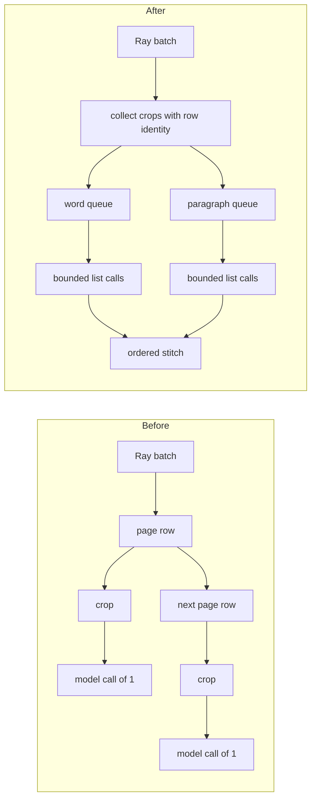

# Local Nemotron OCR v2 cross-page batching

Issue: [#2323](https://github.com/NVIDIA/NeMo-Retriever/issues/2323)

## Decision

Batch compatible local OCR crops across every page row delivered to one
`OCRActor`. Keep the outer model list bounded by `inference_batch_size`, keep
table (`word`) and paragraph merge policies in separate calls, and stitch each
ordered result back to its source row and detection.

This is the narrowest seam that fixes the local defect. It does not change the
Ray page-row batch, Nemotron's internal `detector_max_batch_size`, remote NIM
behavior, or the default batch size.


## Root cause and change

The local branch previously built and invoked `local_jobs` inside the page-row
loop. Sparse pages therefore produced singleton model calls even when one Ray
batch contained enough compatible crops to fill the configured OCR batch.



Three differently scoped controls remain independent:

| Control | Unit | Owner | Value in these experiments |
|---|---|---|---:|
| Ray supply batch | page rows per actor call | Ray graph | 32 |
| Outer OCR list | compatible crops per model call | `OCRActor` | 8 |
| Internal detector batch | images per detector forward | `nemotron-ocr` | 8 |

The installed package preprocesses the entire outer list before internally
chunking detector forwards. The actor must therefore bound the outer list; it
must not pass an unbounded Ray batch to the model.

## Correctness proof

The primary regression uses one pandas batch with two page rows, one chart per
row, `inference_batch_size=2`, and a recording list-input model.

| Behavior | Unchanged upstream | This change |
|---|---|---|
| Paragraph model calls | `[[page A], [page B]]` | `[[page A, page B]]` |
| Invocation count | 2 | 1 |
| Crops per invocation | `[1, 1]` | `[2]` |
| Row, bbox, and fake text identity | preserved | preserved |

The focused test is intentionally red against the exported upstream source:

```text
Expected: one paragraph call with crop IDs [11, 22]
Observed: two paragraph calls with crop IDs [11] and [22]
1 failed in 0.08s
```

The added suite also verifies:

- separate `word` and `paragraph` queues;
- bounded chunking and stable detection order;
- pages with no crops and malformed page rows;
- preservation of existing native text;
- per-crop isolation after a batch exception; and
- singleton fallback when a batch returns the wrong result count.

Fallback is limited to an exception or wrong result count. Real OCR content
differences do not trigger fallback.

## Controlled performance proof

The GPU A/B traversed actual Ray Data batches, the real `OCRActor`, one
persistent local wrapper, and the locked Nemotron OCR v2 model. It used 128
fixed real crops (64 tables and 64 charts), one crop per page row, Ray row
batches of 32, outer list size 8, detector batch size 8, one warmup, and five
measured trials on one H100 80GB.

| Measurement | Upstream | This change | Effect |
|---|---:|---:|---:|
| Model invocations per 128 crops | 128 x scalar | 16 x list-of-8 | 87.5% fewer |
| Median actor throughput | 34.418 crops/s | 55.787 crops/s | 1.621x |
| Median model throughput | 40.654 crops/s | 73.389 crops/s | 1.805x |

All trials preserved crop identity and result cardinality. Real OCR strings
were not byte-stable across repeated trials in either configuration, so exact
real-text equality is not a valid acceptance criterion.

## Retrieval non-regression

The full `vidore_v3_computer_science_beir` experiment covered two PDFs, 1,360
pages, 1,290 queries, and 6,294 qrels with chart, table, infographic, and page
image extraction enabled. Two runs per configuration exposed material
full-pipeline nondeterminism, including upstream-versus-upstream text and rank
changes.

To isolate the indexed corpora, each query was embedded once. Those same 1,290
query vectors were applied to all four corpora using deterministic float64
exact top-10 search.

| Fixed-query metric | Upstream mean | This change mean | Delta |
|---|---:|---:|---:|
| nDCG@10 | 0.7093766 | 0.7093501 | -0.0000265 |
| Recall@5 | 0.6000979 | 0.6000979 | 0.0000000 |
| Recall@10 | 0.7306446 | 0.7307415 | +0.0000969 |

Both matched pairs had identical Recall@5. The warm pair also had identical
Recall@10. Its nDCG@10 delta was +0.000186 with paired 95% bootstrap interval
`[-0.000133, +0.000631]`; the first pair reversed sign and its interval also
contained zero. Mean top-10 overlap was 99.91% in both matched pairs.

Conclusion: no retrieval regression was observed after controlling query and
index execution randomness.

## What is not claimed

- No whole-ingest speedup is claimed. Counterbalanced warm ViDoRe runs were
  effectively tied; the first apparent gain was a cold-cache effect.
- Remote OCR NIM batching is unchanged and remains follow-up work for the
  issue's broader acceptance criteria.
- JP20 was not run. ViDoRe v3 was used as the multimodal retrieval gate.
- No batch default or Nemotron internal detector configuration is changed.

## Reproduction and provenance

Validation on the rebased PR worktree:

| Check | Result |
|---|---|
| Primary test against exported upstream source | expected red: 1 failed in 0.08s |
| Focused patch suite | 4 passed in 0.61s |
| Related actor, graph, OCR, table, and video tests | 327 passed, 7 skipped in 35.03s |
| Pre-commit on every changed file | all hooks passed |

Focused validation from `nemo_retriever/`:

```bash
uv run --frozen pytest -q tests/test_ocr_cross_page_batching.py
uv run --frozen pre-commit run --files \
  src/nemo_retriever/common/modality/ocr/shared.py \
  tests/test_ocr_cross_page_batching.py \
  developer_docs/ocr_cross_page_batching/README.md \
  developer_docs/ocr_cross_page_batching/experiment-results.json \
  developer_docs/ocr_cross_page_batching/proof-summary.svg
```

The controlled experiments used source commit
`611af594818342b655b5e9ae89c66aea2cbc3963`. The PR was then rebased onto
`52886112cafab4c4bca1cda0d4f588785adfe4d3`; the intervening commits do not
change OCR code or `uv.lock`.

The lock SHA-256 is
`d9651104d0a10277642fa7e4794976948177f24c273da203e6bb694107d20bf6`.
Installed versions were `nemotron-ocr==2.0.1.dev20260720042916`,
`ray==2.55.1`, and `torch==2.11.0+cu130`. Machine-readable measurements,
configuration, and artifact hashes are in [experiment-results.json](experiment-results.json).
