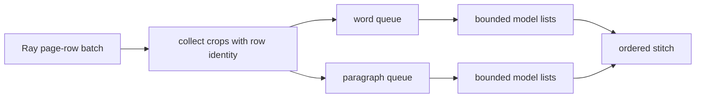

# Local Nemotron OCR v2 cross-page batching

Issue: [#2323](https://github.com/NVIDIA/NeMo-Retriever/issues/2323)

## Decision

Batch compatible local OCR crops across every page row delivered to one
`OCRActor`. Split table (`word`) and paragraph jobs, bound each model list by
`inference_batch_size`, and stitch ordered results back to their source row and
detection.

The old local path created and invoked jobs inside the page-row loop, so sparse
pages reached the persistent model as singleton calls. Collection now spans the
Ray batch while retaining row identity.

Three differently scoped controls remain independent:

| Control | Unit | Owner | Experiment value |
|---|---|---|---:|
| Ray supply batch | page rows per actor call | Ray graph | 32 |
| Outer OCR list | crops per model call | `OCRActor` | 8 |
| Internal detector batch | images per detector forward | `nemotron-ocr` | 8 |

The patch changes only the middle layer. It does not change defaults or wire
the actor setting into Nemotron's internal detector policy.

## Evidence

### Correctness

The red/green regression uses one pandas batch with two page rows, one chart per
row, `inference_batch_size=2`, and a recording list-input model.

| Behavior | Upstream | Patch |
|---|---|---|
| Paragraph calls | `[page A]`, `[page B]` | `[page A, page B]` |
| Invocation count | 2 | 1 |
| Crops per invocation | `[1, 1]` | `[2]` |
| Row, bbox, and fake output identity | preserved | preserved |

The four focused tests also cover merge-level separation, bounded chunking,
empty and malformed pages, native-text preservation, batch exceptions,
wrong-result-count fallback, and per-crop failure isolation. Fallback occurs
only on an exception or wrong result count.

### Attributable OCR speedup

The controlled GPU A/B traversed Ray Data, the real `OCRActor`, one persistent
local wrapper, and the locked Nemotron OCR v2 model. It used 128 fixed real
crops (64 tables and 64 charts), one warmup, and five measured trials on one
H100 80GB.

| Measurement | Upstream | Patch | Effect |
|---|---:|---:|---:|
| Model invocations per 128 crops | 128 x scalar | 16 x list-of-8 | 87.5% fewer |
| Median actor throughput | 34.418 crops/s | 55.787 crops/s | 1.621x |
| Median model throughput | 40.654 crops/s | 73.389 crops/s | 1.805x |

### End-to-end ingest runtime

The registered `vidore_v3_computer_science_beir` harness ran the full 1,360-page
ingest with charts, tables, infographics, page images, multimodal embedding,
and LanceDB indexing enabled. Run order was upstream 1, patch 1, patch 2,
upstream 2 to expose order and cache effects.

| Run | Ingest runtime | Throughput |
|---|---:|---:|
| Upstream 1 (coldest) | 181.616 s | 7.488 pages/s |
| Patch 1 | 168.388 s | 8.077 pages/s |
| Patch 2 | 169.506 s | 8.023 pages/s |
| Upstream 2 | 168.330 s | 8.079 pages/s |

The first pair appears 7.3% faster for the patch, but the counterbalanced warm
pair is effectively tied: the patch is 1.176 seconds (0.70%) slower. Therefore
the experiment proves an actor-stage speedup, not a whole-ingest speedup. Other
pipeline work dilutes the OCR-stage gain below run-to-run variation in this
two-document benchmark.

### Retrieval non-regression

The same ViDoRe run evaluated 1,290 queries and 6,294 qrels. Because repeated
full runs changed page text and rankings even within one configuration, every
query was embedded once and those same vectors were applied to all four stored
corpora using deterministic exact top-10 search.

| Metric | Upstream mean | Patch mean | Delta |
|---|---:|---:|---:|
| nDCG@10 | 0.7093766 | 0.7093501 | -0.0000265 |
| Recall@5 | 0.6000979 | 0.6000979 | 0.0000000 |
| Recall@10 | 0.7306446 | 0.7307415 | +0.0000969 |

Both matched pairs had identical Recall@5; the warm pair also had identical
Recall@10. Mean top-10 overlap was 99.91%. No retrieval regression was observed
after controlling query and index execution randomness.

## Scope and validation

This record supports the local Nemotron OCR v2 change only. Remote OCR NIM
batching remains follow-up work. JP20 was not run, and no whole-ingest speedup
or byte-identical real OCR output is claimed.

Validation on the rebased PR worktree:

- expected upstream red: 1 failed in 0.08s;
- focused patch suite: 4 passed in 0.61s;
- related actor, graph, OCR, table, and video tests: 327 passed, 7 skipped;
- all pre-commit hooks and required PR validation checks passed.

Experiments used source commit `611af594818342b655b5e9ae89c66aea2cbc3963`
and lock SHA-256
`d9651104d0a10277642fa7e4794976948177f24c273da203e6bb694107d20bf6`.
Installed versions were `nemotron-ocr==2.0.1.dev20260720042916`,
`ray==2.55.1`, and `torch==2.11.0+cu130`.
